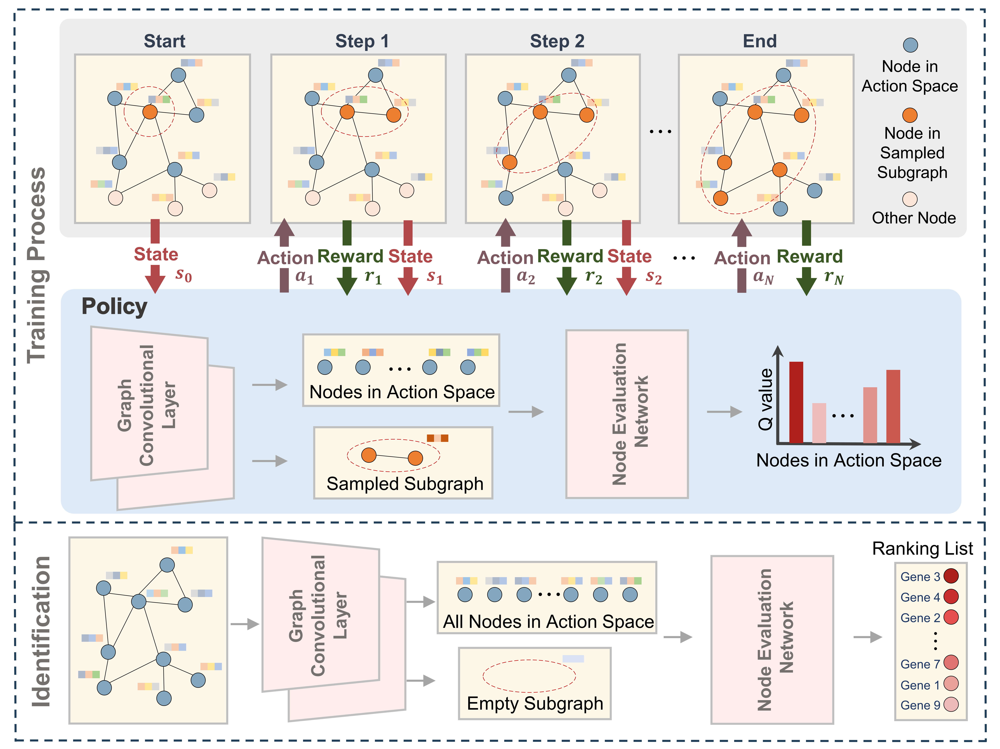

# RL-GenRisk
## Overview of the framework
RL-GenRisk is a deep reinforcement learning-based method for clear cell renal cell carcinoma (ccRCC) risk gene identification. RL-GenRisk frames the identification of ccRCC risk genes as a Markov decision process, combining the graph convolutional network and Deep Q-Network for risk gene identification. The following depicts a broad overview of the RL-GenRisk

<div align="center">

</div>


## Installation & Dependencies
The code is written in Python 3 and was mainly tested on Python 3.9 and a Linux OS but should run on any OS that supports python and pip. Training is faster on a GPU but works also on a standard computer. The package development version is tested on Linux and Windows 10 operating systems. The developmental version of the package has been tested on the following systems:

* Linux: Ubuntu 22.04.3 LTS
* Windows: 10


RL-GenRisk has the following dependencies:

* networkx
* torch
* torch-cluster
* torch-geometric
* torch-scatter
* torch-sparse
* torch-spline-conv
* scikit-learn
* pandas
* numpy


## Running RL-GenRisk
To clone this repository, users can use:
```
git clone https://github.com/23AIBox/RL-GenRisk.git
```

Setup the required environment using `requirements.txt` with python. While in the project directory run:
```
pip install -r requirements.txt
```
We also provided a conda environment file, users can build the environment by running:
```
conda env create -f environment.yaml
```
We upload a trained model for clear cell renal cell carcinoma risk gene identification. To run this model you can use command line instructions:
```
python identify.py
```
After the running is completed, the file `Ranking_List.txt` is output in the corresponding directory, which contains the identified gene risk ranking list.

## Additional datasets

We used datasets of known ccRCC risk genes from multiple sources. Links to the databases and publications can be found below. 


#### IntOGen version 2023.05.31
https://www.intogen.org/download

#### Network of Cancer Genes (NCG) version 7.1
http://network-cancer-genes.org/download.php

#### The Cancer Gene Census (CGC) v100
https://cancer.sanger.ac.uk/census

#### Bailey et al.
Table S1 from https://www.cell.com/cms/10.1016/j.cell.2018.02.060/attachment/cf6b14b1-6af1-46c3-a2c2-91008c78e87f/mmc1.xlsx
